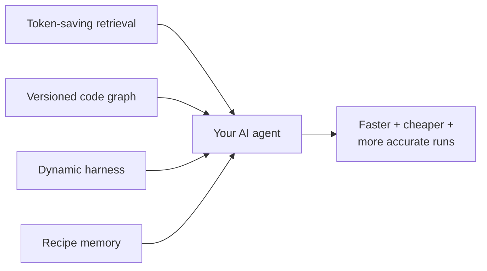

# CodraGraph — release 2026-04-30

A coordinated 9-package release covering an end-to-end correctness pass
across the CodraGraph platform: package rename → scoped npm names →
Windows-correct launchers → Codex installer → SDK exports → CI gates →
documentation. Every published package received attention; no breaking
behavior changes are intended.

## What's in this release

| Package | Old → New | Highlights |
|---|---|---|
| `@codragraph/cli` | 1.6.3 → **1.6.4** | Setup writes correct MCP commands on every OS; `cmd /c codragraph mcp` on Windows; per-connection FTS + JS fallback for cross-platform search; AGENTS/CLAUDE templates point at the right scoped npm name |
| `@codragraph/shared` | 1.0.0 → **1.0.1** | Un-private'd for publication; build hygiene |
| `@codragraph/graphstore` | 0.1.1 → **0.1.2** | Tightened workspace dep ranges (`^X.Y.Z` instead of `*`) |
| `@codragraph/harness` | 0.1.1 → **0.1.2** | Same dep-range hygiene; minor test cleanup |
| `@codragraph/compress` | 0.1.1 → **0.1.2** | Dep-range hygiene |
| `@codragraph/sdk` | 0.1.1 → **0.1.2** | Re-exports `LocalGraphClient`; new `createLocalGraphClient()` factory hides the deep CLI import; README rewritten with working examples |
| `@codragraph/org` | 0.1.1 → **0.1.2** | Dep-range hygiene |
| `@codragraph/codex` | (new) → **0.1.1** | First-time publish. New `codragraph-codex` bin auto-wires Codex hooks + MCP into `~/.codex/config.json` with sidecar-tracked merge that preserves user-managed entries. Quoted hook paths handle install dirs with spaces. BOM-tolerant config parsing for PowerShell/Notepad-saved JSON |
| `@codragraph/claude-plugin` | (new) → **0.1.1** | First-time publish. PreToolUse + PostToolUse hooks + 7 skills + plugin manifest. Cross-platform launcher in skill MCP configs |

## The four capabilities (recap)



1. **Token-saving retrieval** — graph-aware search returns only what
   your agent needs. Same query, ~8× fewer tokens than grep.
2. **Versioned code graph** — Dolt-shaped content-addressed snapshots
   per `analyze`. Diff / branch / merge / blame across history.
3. **Dynamic harness** — Meta-Harness Pareto search auto-tunes the
   harness per task family across (accuracy, tokens, latency).
4. **Recipe memory (the moat)** — cache top harness recipes keyed by
   `(snapshot_id, task_family)`. Reuse when the relevant subgraph hasn't
   changed.

## Who this release is for

| If you are… | Install |
|---|---|
| **A solo developer using Claude Code, Cursor, Codex CLI, or OpenCode** | `npm i -g @codragraph/cli && codragraph setup && codragraph analyze .` |
| **Building your own agent or tool on top of CodraGraph** | `npm i @codragraph/sdk` |
| **Running OpenAI Codex CLI specifically** | `npm i -g @codragraph/codex && codragraph-codex` |
| **Running Claude Code specifically** | `claude plugins install codragraph` (once published to the marketplace) — or `claude plugins install file://path/to/integrations/claude` |
| **Just need versioned graph storage (no AI)** | `npm i @codragraph/graphstore` |
| **Auto-tuning harnesses for your own task family** | `npm i @codragraph/harness` |
| **Building a multi-tenant hosted version** | `npm i @codragraph/org` (scaffolded — not yet wired into the server) |

## Notable fixes in this round

- **Package rename**: every doc/skill/hook reference now uses scoped npm
  names (`@codragraph/cli`, etc.) — the unscoped `codragraph` package
  was never published and a stray reference would 404.
- **Windows launcher correctness**: `where codragraph` returns the
  extensionless Unix shim before `codragraph.cmd` on Windows. Setup,
  hooks, and static MCP configs now route through `cmd /c` so PATHEXT
  resolves the shim correctly.
- **Codex installer**: new `codragraph-codex` bin substitutes
  `${CODRAGRAPH_PLUGIN_ROOT}` and `${HOME}` at install time, quotes the
  hook path for install dirs with spaces, tolerates BOM-prefixed JSON,
  and uses a sidecar (`~/.codex/.codragraph-managed.json`) to preserve
  user-managed hook entries on re-install.
- **Cross-platform search**: when LadybugDB FTS returns 0 results
  (observed on macOS native bindings), `searchFTSFromCgdb` falls back to
  a JavaScript scanner with weighted scoring — search now works
  consistently across Linux + macOS + Windows.
- **CI**: matrix runs on Ubuntu/macOS/Windows × Node 20/22. CLI vitest
  segfaults on Windows (vitest 4 native-module bug) and macOS LadybugDB
  integration test crashes on the GHA macOS image, both gated to Linux.
- **Lint**: `@typescript-eslint/no-explicit-any` and
  `no-non-null-assertion` disabled for now (3,961-warning baseline);
  re-enable behind a ratchet when paid down.

## Verifying the install

```sh
# CLI sanity
npm install -g @codragraph/cli
codragraph --version    # should print 1.6.4
codragraph setup        # configures the editors you have installed

# In a real repo
codragraph analyze .
codragraph query "auth flow"
codragraph context <a real symbol name>
```

## Upgrade notes

- **From `codragraph` (unscoped) to `@codragraph/cli`**: the unscoped
  name was never published. If you have an old install referencing it,
  uninstall and reinstall: `npm uninstall -g codragraph && npm install -g @codragraph/cli`.
- **Codex users**: re-run `codragraph-codex` after upgrading. The
  installer is idempotent, will migrate any stale entries (literal
  `${HOME}` left over from earlier installer versions), and preserves
  any hooks you've added yourself.
- **SDK users**: `HttpGraphClient` is still exported but throws — it's a
  Phase 2 placeholder for hosted scenarios. Use `createLocalGraphClient()`
  for in-process or talk to a running `codragraph serve` over MCP.

## Acknowledgements

Big chunk of this release came from a multi-agent workflow — Claude Code
and Codex were both pulling at the same codebase. The macOS FTS fallback
was Codex's elegant fix for a problem that wasn't tractable to debug
without a macOS environment.
