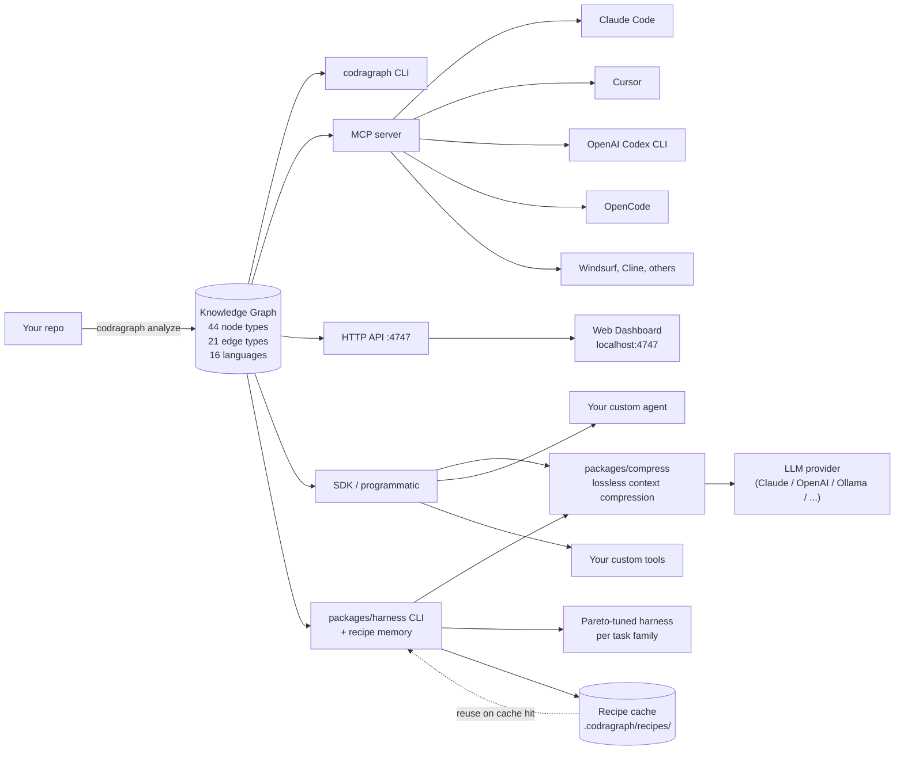
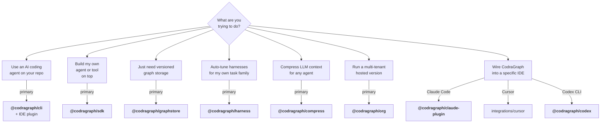
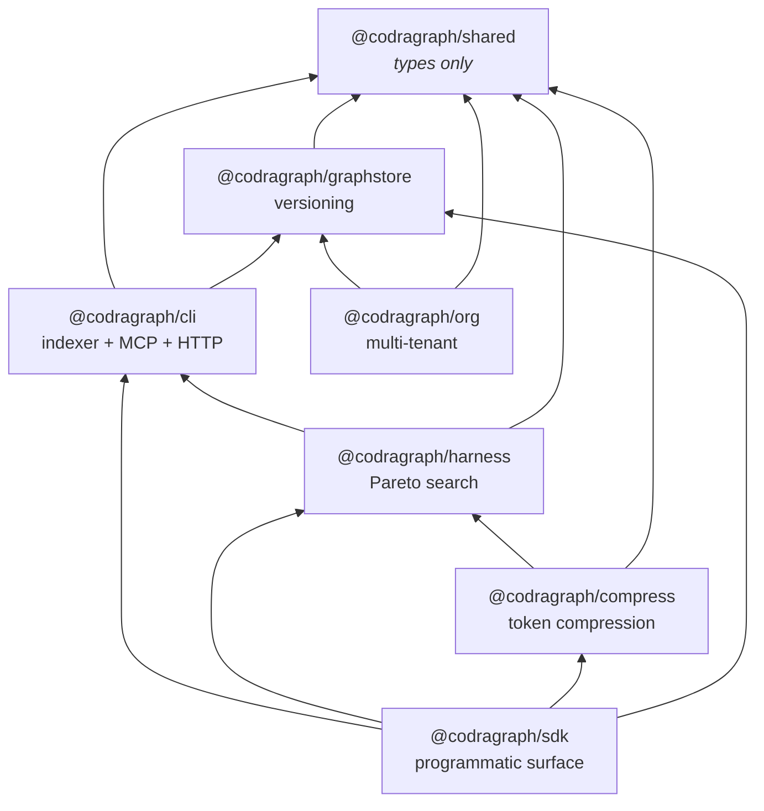
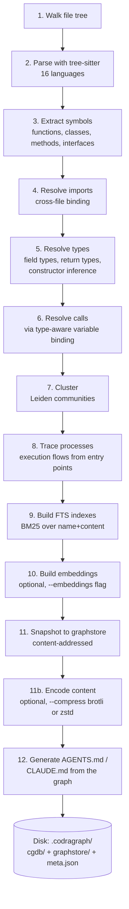
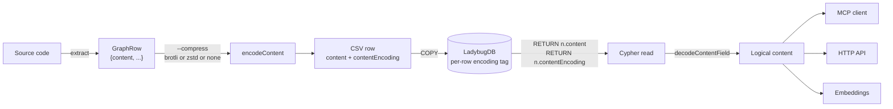
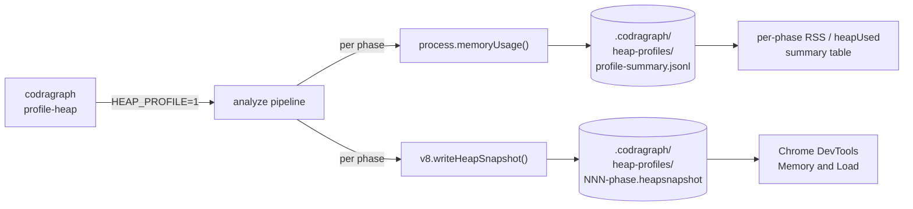
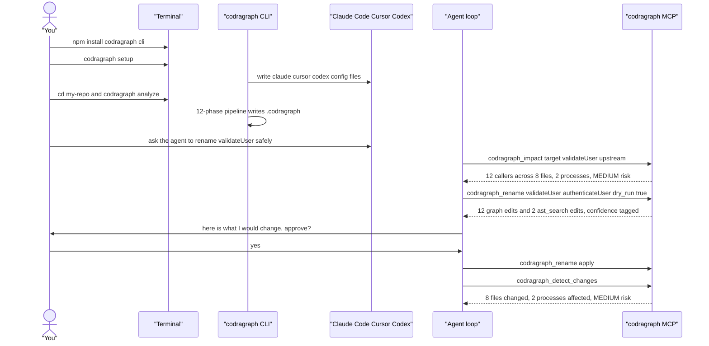
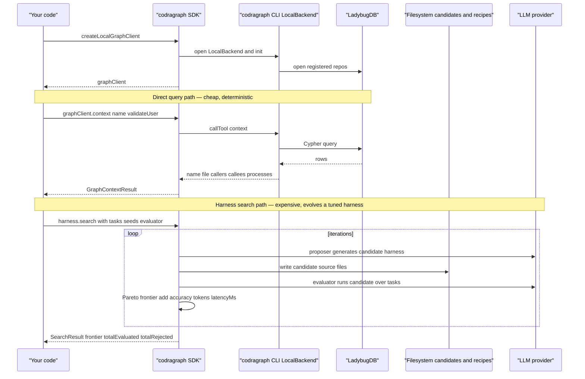
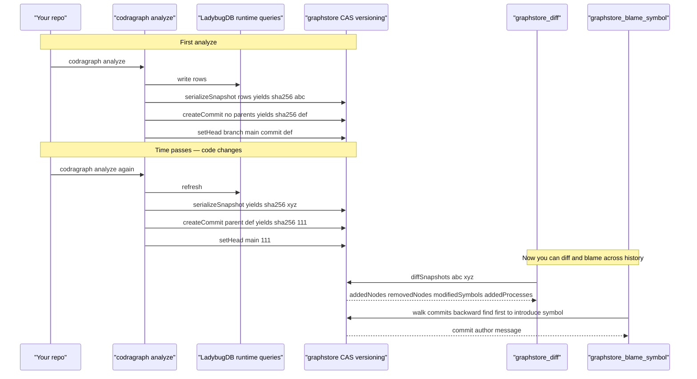
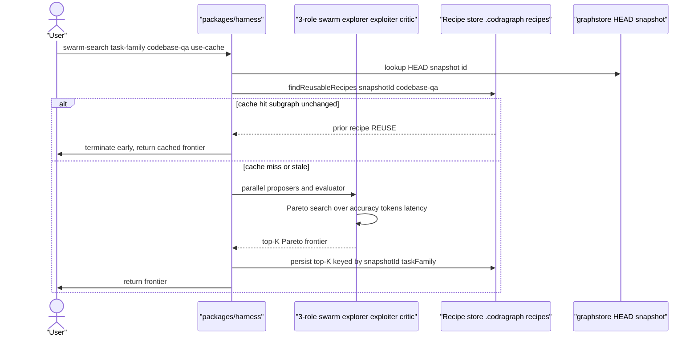

<p align="center">
  
</p>

<h1 align="center">CodraGraph</h1>

<p align="center">
  Graph-powered code intelligence for AI agents — index any codebase,
  query via MCP or CLI, version it like git, and auto-tune the harness
  per task family.
</p>

<p align="center">
  <a href="./LICENSE"></a>
  
  
  <a href="https://www.npmjs.com/package/@codragraph/cli"></a>
</p>

---

## TL;DR

AI coding agents don't *understand* your codebase — they grep through it.
CodraGraph replaces that with a **precomputed knowledge graph** of every
function, class, call, import, and execution flow, then exposes it to
your agent over MCP / SDK / CLI / HTTP. Same query that took 32k tokens
of grep now takes 4k tokens of structural answer.

```sh
# One command. No global install, no separate setup step.
# First run: auto-wires MCP into Claude / Cursor / Codex / OpenCode, then indexes.
# Subsequent runs: just re-indexes (~30s for a 50k-LoC repo).
npx @codragraph/cli analyze .

# Or install globally once and re-use the `codragraph` binary:
npm install -g @codragraph/cli
codragraph analyze .        # auto-runs setup on first invocation; --no-setup to opt out
# → your agent now has codragraph_query / context / impact / detect_changes
```

## What you get



Four capabilities ship together — pick the ones that matter for your use
case, the rest are zero-cost when ignored:

| Capability | What it does | Best for |
|---|---|---|
| **Token-saving retrieval** | Graph-aware search returns only what your agent actually needs | Anyone running an LLM agent on a real codebase |
| **Versioned code graph** | Snapshot the graph each `analyze` (Dolt-shaped, content-addressed); diff / branch / merge / blame | PR review, regression tracing, code-archeology workflows |
| **Dynamic harness** | Auto-tune the harness per task-family using Meta-Harness Pareto search over (accuracy, tokens, latency) | Agent builders who want their bots to self-improve |
| **Recipe memory (the moat)** | Cache top harness recipes keyed by `(snapshot_id, task_family)`. Reuse when the relevant subgraph hasn't changed | Anyone who runs the harness more than once |

---

## Who needs what — pick your starting package



### Package matrix

| Package | Audience | What it gives you | Install |
|---|---|---|---|
| **[`@codragraph/cli`](./packages/core)** | Solo devs, anyone with a coding agent | CLI + MCP server + HTTP API + indexer + web dashboard. The "everything in one bin" path. | `npm i -g @codragraph/cli` |
| **[`@codragraph/sdk`](./packages/sdk)** | Agent builders, tool authors | Single-import programmatic surface re-exporting `graph`, `harness`, `graphstore`, `compress`. Subpath imports for tree-shaking. | `npm i @codragraph/sdk` |
| **[`@codragraph/graphstore`](./packages/graphstore)** | Anyone who wants snapshots/branches/diffs/merge over a property graph (no AI needed) | Engine-agnostic content-addressed versioning layer. Works with any RowSource. | `npm i @codragraph/graphstore` |
| **[`@codragraph/harness`](./packages/harness)** | Researchers, agent infra teams | Meta-Harness Pareto search + 3-role swarm + recipe memory. CLI: `packages/harness`. | `npm i @codragraph/harness` |
| **[`@codragraph/compress`](./packages/compress)** | Anyone bottlenecked by LLM context | Lossless semantic compression for LLM contexts. Strip grammar, keep facts. | `npm i @codragraph/compress` |
| **[`@codragraph/org`](./packages/org)** | SaaS / multi-tenant builders | Multi-tenant orgs, SSO, RBAC, tamper-evident audit log (built on graphstore CAS). | `npm i @codragraph/org` |
| **[`@codragraph/codex`](./integrations/codex)** | OpenAI Codex CLI users | Codex hooks + MCP wiring. Bin: `codragraph-codex`. | `npm i -g @codragraph/codex` |
| **[`@codragraph/claude-plugin`](./integrations/claude)** | Claude Code users | PreToolUse + PostToolUse hooks + 7 skills + MCP. | `claude plugins install codragraph` |
| [`integrations/cursor`](./integrations/cursor) | Cursor users | beforeShellExecution hook + 7 skills (drop into `.cursor/` of your repo) | manual copy |
| `@codragraph/shared` | (internal) | Shared TypeScript types. Not consumed directly. | — |

### The dependency graph



---

## How it works — the indexing pipeline

`codragraph analyze` runs a 12-phase DAG that walks your tree, parses
every file with tree-sitter, resolves imports + types + call chains,
clusters related symbols, traces execution flows, builds search indexes,
and writes everything to a local LadybugDB graph database under
`.codragraph/`:



Languages with full support: **TypeScript, JavaScript, Python, Java,
Kotlin, C#, Go, Rust, PHP, Ruby, Swift, C, C++, Dart**. Imports +
heritage + type annotations + framework detection + entry-point scoring
all language-specific via the `LanguageProvider` hook system.

---

## Built-in skills

`codragraph setup` installs 32 workflow skills into your editor's skills
directory (`.claude/skills/`, `.cursor/skills/`, `.opencode/skill/`,
`.agents/skills/`). Each one is a markdown recipe Claude / Cursor / Codex
loads when a matching trigger phrase shows up — turning the MCP tools
(and where applicable, raw `git` / `gh`) into named workflows your agent
already knows how to execute.

**Code intelligence (graph-driven):**

| Skill | Trigger phrases |
|---|---|
| `codragraph-guide` | "what does codragraph do", "list MCP tools" |
| `codragraph-cli` | "codragraph command", "how do I index" |
| `codragraph-exploring` | "how does X work", "tour this codebase" |
| `codragraph-impact-analysis` | "what breaks if I change X", "blast radius" |
| `codragraph-debugging` | "why is X failing", "debug this error" |
| `codragraph-refactoring` | "rename safely", "extract this" |
| `codragraph-pr-review` | "review this PR", "is this safe to merge" |

**Dev power-tools:**

| Skill | Trigger phrases |
|---|---|
| `codragraph-test-coverage` | "what isn't tested", "coverage gaps" |
| `codragraph-dead-code` | "find unused code", "can I delete this" |
| `codragraph-api-surface` | "what's our public API", "list exports" |
| `codragraph-onboarding` | "I'm new here", "give me a tour" |
| `codragraph-migration-tracking` | "how far is the migration", "what's left" |

**Data engineering / data science:**

| Skill | Trigger phrases |
|---|---|
| `codragraph-data-lineage` | "trace this column", "data lineage" |
| `codragraph-sql-tracing` | "find this SQL", "who calls this query" |
| `codragraph-notebook-context` | "summarize these notebooks", "refactor this analysis" |

**Multi-project / vibecoding:**

| Skill | Trigger phrases |
|---|---|
| `codragraph-project-switcher` | "switch to my X repo", "list my projects" |
| `codragraph-cross-repo-impact` | "cross-repo blast radius", "what services consume X" |

**Git workflow:**

| Skill | Trigger phrases |
|---|---|
| `codragraph-git-rebase-vs-merge` | "rebase or merge", "which merge strategy", "clean up branch history" |
| `codragraph-git-force-push` | "force push", "is force push safe", "someone overwrote my work" |
| `codragraph-git-recovery` | "I lost my commits", "deleted my branch", "reset --hard mistake" |
| `codragraph-git-bisect` | "find which commit broke X", "git bisect", "regression hunt" |
| `codragraph-git-worktree` | "work on two branches at once", "hotfix without losing context" |
| `codragraph-git-history-rewrite` | "squash my commits", "remove leaked secret", "split a commit" |

**GitHub CLI workflow:**

| Skill | Trigger phrases |
|---|---|
| `codragraph-gh-pr-workflow` | "open a PR", "merge this PR", "address review comments" |
| `codragraph-gh-issue-workflow` | "open an issue", "triage issues", "GitHub projects" |
| `codragraph-gh-actions-debug` | "why did CI fail", "rerun this workflow", "dispatch workflow" |
| `codragraph-gh-release-workflow` | "cut a release", "draft release notes", "prerelease tagging" |

**Domain (security / perf / ops):**

| Skill | Trigger phrases |
|---|---|
| `codragraph-security-audit` | "security audit", "find auth bypass", "unvalidated input" |
| `codragraph-perf-hotspots` | "find perf hotspots", "where should I profile", "hot paths" |
| `codragraph-observability-coverage` | "observability coverage", "missing traces", "where are we flying blind" |
| `codragraph-config-audit` | "audit env vars", "unused config", "feature flag usage" |
| `codragraph-supply-chain-audit` | "audit dependencies", "what would break if I drop X", "CVE exposure" |

Trigger phrases are illustrative — the actual matching is done by the
LLM's skill-router based on the skill's `description` frontmatter, so
anything semantically close works. Some git / GitHub skills use
CodraGraph tools (`diff --semantic`, `impact`, `query`) where the graph
adds real signal; others are pure workflow recipes when the graph
doesn't help.

---

## Per-area skill files (`--skills`)

Generic project context (one big AGENTS.md / CLAUDE.md) is fine for an
overview, but when the agent is actually working on the auth module it
shouldn't have to re-derive what auth *is* every time. CodraGraph's
Leiden clustering already groups your symbols into functional
communities — `--skills` turns each significant community into its own
`SKILL.md` so the agent loads only what it needs:

```sh
codragraph analyze --skills
# → .claude/skills/generated/<community>/SKILL.md, one per cluster
```

Each generated `SKILL.md` includes: when to use it, dominant directory,
key files, exported entry points, all member symbols, the execution
flows that touch this area, and which other clusters call into it.

By default, skills emit only to `.claude/skills/generated/`. To target
multiple editors at once:

```sh
codragraph analyze --skills --skill-targets claude,cursor,opencode,codex
```

Each editor gets its own copy under its conventional project skill dir
(`.claude/skills/generated/`, `.cursor/skills/generated/`,
`.opencode/skill/generated/`, `.codex/skills/generated/`).

---

## PR review GitHub Action

Every PR gets a sticky comment with the structural diff between base and
head — removed APIs, added APIs, modified signatures, added/removed
execution flows, and a heuristic risk level. No LLM in the default mode,
$0 per PR. Optional `mode: review` calls Anthropic for a richer
human-readable review on top.

```yaml
# .github/workflows/codragraph-pr-review.yml
name: CodraGraph PR Review
on:
  pull_request:
    types: [opened, synchronize]

permissions:
  contents: read
  pull-requests: write

jobs:
  review:
    runs-on: ubuntu-latest
    steps:
      - uses: actions/checkout@v4
        with:
          fetch-depth: 0
      - uses: AnitChaudhry/CodraGraph/.github/actions/codragraph-pr-review@main
        with:
          mode: deterministic
          # mode: review
          # anthropic-api-key: ${{ secrets.ANTHROPIC_API_KEY }}
```

> ⚠️ Requires `@codragraph/cli ≥ 1.7.0` (introduces `analyze --no-setup`,
> `diff --semantic --json`, and the graphstore `headCommit` write the action
> reads from). If you're consuming this from another repo before 1.7.0 ships,
> the action will fail on the analyze step.

Mechanically: indexes base + head with `codragraph analyze`, reads each
graphstore `headCommit`, runs `codragraph diff <base> <head> --semantic
--json`, formats as Markdown, posts (or updates) a sticky comment. See
[`.github/actions/codragraph-pr-review/README.md`](./.github/actions/codragraph-pr-review/README.md)
for inputs, cost guidance, and caveats.

This is the **automated** side of PR review. The `codragraph-pr-review`
[skill](./packages/core/skills/codragraph-pr-review.md) is the
**human-triggered** side — ask Claude/Cursor "review this PR" and it
runs the same MCP tools on demand. Both can run on the same PR.

---

## Auto-reindex on commit

The Claude Code `PostToolUse` hook (installed by `codragraph setup`)
detects when a `git commit` / `merge` / `rebase` / `pull` made the
index stale. Default behavior is to notify the agent so it can reindex
at a quiet point. To enable background auto-reindex instead:

```sh
# Either set the env var:
export CODRAGRAPH_AUTO_REINDEX=1

# Or persist it in ~/.codragraph/config.json (survives Windows GUI launches):
echo '{ "autoReindex": true }' > ~/.codragraph/config.json
```

When enabled, the hook spawns a detached `codragraph analyze --no-setup`
in the background. A `.codragraph/.reindex.coalesce` file gates
concurrent runs (single in-flight reindex per repo); analyze deletes it
on exit. If an MCP server is currently holding LadybugDB, the
background reindex fails silently — run `codragraph analyze` manually
after closing the agent session.

---

## Storage compression & heap profiling

Two opt-in flags address the "this graph is huge" and "where is heap
going" questions for repos that have outgrown the default settings.
Default behavior is unchanged when neither flag is set.

### `--compress brotli|zstd|none` — per-row body compression

Every node table that has a `content` column also carries a
`contentEncoding STRING DEFAULT 'none'` column. With `--compress` set,
analyze routes each content field through `encodeContent` before it
hits the CSV; readers pick up the encoding tag and decode at every
external-consumer boundary (MCP, HTTP API, embeddings, CLI tools). With
the flag unset, the wire format is byte-identical to pre-1.8.x indexes.



```sh
codragraph analyze --compress brotli   # Node ≥ 18 (default brotli quality 6)
codragraph analyze --compress zstd     # Node ≥ 22.15 (level 3)
codragraph analyze --compress none     # explicit default (no encoding)
```

The encoder params are pinned (brotli quality 6, zstd level 3) — same
input + same encoding always produces byte-identical output, which is
load-bearing for content-addressed snapshot ids. Changing either is a
wire-format break and a major-version bump. zstd readers on Node < 22.15
get a clear forward-compat error rather than wrong content.

`INDEX_SCHEMA_VERSION = 2`. Existing 1.7.x indexes are auto-detected and
forced through a re-analyze the first time a 1.8+ CLI runs against them
— there's a log line that says why so the re-index isn't a mystery.

**Search behaviour under `--compress`.** BM25 / FTS skips the encoded
`content` column when the repo was analysed with compression on — the
index falls back to symbol-name matches so
search is narrower but never wrong. Embeddings, graph queries, and
`codragraph context` / `impact` are unaffected (they decode at the
read boundary). Run with `--compress none` if you rely on full-text
search inside function bodies.

### `codragraph profile-heap` — heap-profile a real run

Wraps `analyze` with the heap-profile instrumentation, captures a v8
heap snapshot at every phase boundary, writes a crash-safe
`profile-summary.jsonl` of `process.memoryUsage()` per phase, then
prints a per-phase RSS / `heapUsed` summary table.



```sh
codragraph profile-heap                 # run analyze with profiling on
codragraph profile-heap --no-summary    # skip the post-run table (raw artifacts only)
```

Each `.heapsnapshot` is 100–500 MB, so this is opt-in only. The JSONL
timeline is small enough to ship around for triage even when the
snapshots are too big to share. Use the per-phase RSS column to figure
out which phase to focus on before reaching for the full snapshots.

---

## User flows

### Flow 1 — Solo dev with a coding agent (most common)



### Flow 2 — Programmatic / building your own agent on top

> Every symbol below is real and exported through `@codragraph/sdk` —
> verify with `npm view @codragraph/sdk` or the source under
> [`packages/sdk/src/`](./packages/sdk/src). Pre-req: `codragraph
> analyze .` has been run at least once in the repo you're querying.



**Inputs and outputs (real types from `@codragraph/sdk`):**

```ts
// install: npm i @codragraph/sdk
import { harness, graph, type TaskInput } from "@codragraph/sdk";

// 1) Open an in-process graph client.
//    Same LocalBackend the codragraph CLI uses — reads from your
//    locally-registered repos (the ones `codragraph analyze` indexed).
const graphClient = await graph.createLocalGraphClient();
//   ↳ returns: LocalGraphClient (implements GraphClient interface)

// 2) Direct query — input + output shapes are explicit.
const ctx = await graphClient.context({ name: "validateUser" });
//   input:  GraphContextInput  = { name: string; repo?: string }
//   output: GraphContextResult = {
//     name: string;
//     file?: string;
//     callers?:  Array<{ name: string; file?: string }>;
//     callees?:  Array<{ name: string; file?: string }>;
//     processes?: string[];   // execution-flow names this symbol belongs to
//   }
console.log(ctx.callers, ctx.callees, ctx.processes);

// 3) Auto-tune a harness. Inputs are concrete; outputs are a Pareto frontier.
const inference = await harness.makeInferenceProvider("claude");
//   ↳ returns: InferenceProvider — adapter to Anthropic / OpenAI / OpenCode

// Tasks: an array of {id, question, repo?, metadata?} — your real eval set
const tasks: TaskInput[] = [
  { id: "t-001", question: "Where is JWT validation done?" },
  { id: "t-002", question: "What breaks if I rename validateUser?" },
  // ...
];

const result = await harness.search({
  tasks,                                              // search-set 𝒳
  iterations: 20,                                     // outer-loop N
  candidatesPerIteration: 2,                          // per-iteration k
  inference,
  graph: graphClient,
  proposer: new harness.ClaudeCodeProposer({          // what writes new harnesses
    contractPath: "./harness-contract.md",
  }),
  store: new harness.CandidateStore(                  // filesystem 𝒟 — where
    "./runs/today/candidates",                        //   candidates live on disk
  ),
  evaluator: new harness.CodebaseQAEvaluator(),       // scores answers
  seeds: harness.ALL_SEEDS,                           // [zeroShot, fewShot, graphAware]
  budget: { maxInputTokens: 16000, maxOutputTokens: 1024 },
  loadCandidate: (dir) => import(`${dir}/source/index.ts`),
});

//   output: SearchResult = {
//     frontier: Array<{ id: string; accuracy: number; tokens: number; latencyMs: number }>;
//     totalEvaluated: number;
//     totalRejected: number;
//   }
console.log(result.frontier);
// → [
//     { id: "graphAware",  accuracy: 0.83, tokens: 12_400, latencyMs: 4100 },
//     { id: "candidate-7", accuracy: 0.86, tokens: 18_200, latencyMs: 6300 },
//     { id: "candidate-3", accuracy: 0.78, tokens:  8_900, latencyMs: 2700 },
//   ]
// — non-dominated points: nothing else simultaneously beats them on
// (accuracy↑, tokens↓, latencyMs↓). Pick one based on your cost budget.
```

**On disk after the run:**

```
runs/today/candidates/
  graphAware/
    source/index.ts          # the harness code (a Harness instance)
    score.json               # { accuracy, tokens, latencyMs, perTask: [...] }
    traces/                  # one JSONL per task: prompts, tool calls, answers
  candidate-7/
    source/index.ts          # written by the proposer (Claude Code)
    score.json
    traces/
  candidate-3/
    ...
```

### Flow 3 — Versioned graph (graphstore on its own, no AI)



### Flow 4 — Auto-tuning a harness per task family



---

## At a glance — common commands

```sh
# CLI surface (after npm i -g @codragraph/cli)
codragraph setup                       # one-time MCP wiring for installed editors
codragraph analyze .                   # build / refresh the knowledge graph
codragraph analyze --embeddings        # also build semantic-search embeddings
codragraph analyze --compress brotli   # opt-in per-row body compression (also: zstd, none)
codragraph profile-heap                # run analyze with heap-profile instrumentation
codragraph query "auth flow"           # graph-aware search (returns processes, not just files)
codragraph context authenticate        # 360° view of a symbol (callers, callees, processes)
codragraph impact authenticate         # blast-radius analysis at depth 1/2/3
codragraph detect-changes              # map current git diff to affected execution flows
codragraph rename foo bar --dry-run    # multi-file coordinated rename
codragraph mcp                         # start MCP server (stdio)
codragraph serve                       # start HTTP + web dashboard at :4747

# Versioned graph
codragraph log                         # commit history of the knowledge graph
codragraph diff main feature           # structural diff between branches
codragraph diff main feature --semantic  # signature/visibility/body diff per symbol
codragraph branch list/create/delete   # graph branches
codragraph merge feature               # three-way merge with conflict detection
codragraph blame fn:authenticate       # which commit changed this symbol last
codragraph gc                          # mark-and-sweep unreachable objects

# Auto-tuned harness (after npm i @codragraph/harness)
packages/harness swarm-search \
  --task ./tasks.json \
  --task-family codebase-qa \
  --use-cache                          # reuse cached recipe if subgraph unchanged
packages/harness recipes list
packages/harness recipes show <id>
```

---

## Web dashboard

`codragraph serve` mounts a local web app at `http://localhost:4747`:

- **Overview** — repo stats, recent commits, top recipes, capability cards
- **Graph** — Sigma.js explorer with chat / file-tree / code panels
- **Projects** — cross-repo group view (provider→consumer contracts, linked repos, sync status)
- **History** — branch picker, commit list, structural + semantic diff with breakage callouts (removed APIs, modified signatures, visibility changes)
- **Recipes** — versioned harness-recipe browser with Pareto coords, snapshot id, provenance
- **⌘K command palette** — jump to any section, repo, commit, or recipe

---

## API keys

All packages share one config file at `~/.codragraph/config.json`:

```sh
codragraph config set claude   --api-key sk-ant-...
codragraph config set openai   --api-key sk-...
codragraph config set opencode --base-url http://localhost:4096
codragraph config list
```

Resolution order: code-level option → config file → env var
(`ANTHROPIC_API_KEY`, `OPENAI_API_KEY`, `OPENCODE_API_KEY`, …).

---

## MCP tools your agent gets

After `codragraph setup`, your agent can call these tools natively:

| Tool | Purpose |
|---|---|
| `list_repos` | Discover all indexed repositories |
| `query` | Process-grouped semantic + graph search (BM25 + embeddings + RRF) |
| `context` | 360° symbol view: incoming + outgoing references categorized by relation type, plus process participation |
| `impact` | Blast-radius analysis with depth grouping and confidence per relationship |
| `detect_changes` | Maps git diff to affected processes — pre-commit gate |
| `rename` | Multi-file coordinated rename with confidence-tagged edits |
| `cypher` | Raw graph queries (read `codragraph://repo/{name}/schema` first) |
| `route_map` / `tool_map` / `shape_check` | Service-mapping tools for microservice repos |
| `api_impact` | Cross-service blast-radius for HTTP/gRPC contracts |
| `group_list` / `group_sync` | Multi-repo group orchestration |
| `harness_run` / `harness_swarm_run` / `harness_recipes_*` | Run / cache the auto-tuned harness from inside an agent |
| `graphstore_log` / `branches` / `diff` / `semantic_diff` / `merge` / `gc` / `blame_symbol` | Versioned-graph operations from inside an agent |

---

## Status

**Developer preview** (2026-04). Cross-platform CI green on
Ubuntu/macOS/Windows × Node 20/22. The MCP / CLI / SDK / HTTP surfaces
are stable for solo-dev usage; multi-tenant/org features (`@codragraph/org`)
are scaffolded but not yet wired into the server (gated behind a future
`CODRAGRAPH_REQUIRE_AUTH=1` flag).

Currently published versions on npm:

| Package | Version | Notes |
|---|---|---|
| `@codragraph/cli` | 2.0.0 | `--compress brotli/zstd`, `profile-heap`, compression-aware FTS, Windows cgdb fix; pre-2.0 indexes auto-re-analyze on first run |
| `@codragraph/shared` | 1.0.1 | |
| `@codragraph/graphstore` | 1.0.0 | brotli/zstd encoders + content-addressed hash-stability invariant |
| `@codragraph/harness` | 0.2.0 | dep range bumped to `cli ^2.0.0` |
| `@codragraph/compress` | 0.1.2 | LLM-context compression — distinct from `--compress` (storage) |
| `@codragraph/sdk` | 0.2.0 | dep ranges bumped to `cli ^2.0.0`, `graphstore ^1.0.0`, `harness ^0.2.0` |
| `@codragraph/org` | 0.2.0 | dep range bumped to `graphstore ^1.0.0` |
| `@codragraph/codex` | 0.1.1 | |
| `@codragraph/claude-plugin` | 0.1.1 | |

Pre-2.0 indexes (`schemaVersion < 2`) are auto-detected and force a full
re-analyze on first 2.0+ run; the on-disk format is otherwise byte-identical
when `--compress` is unset.

---

## Community & support

Help, discussion, and bug reports — pick the right channel:

| Channel | Use it for |
|---|---|
| **GitHub Issues** ([open one](https://github.com/AnitChaudhry/CodraGraph/issues/new/choose)) | Bug reports, feature requests, integration questions, anything reproducible |
| **GitHub Discussions** ([browse](https://github.com/AnitChaudhry/CodraGraph/discussions)) | Show-and-tell, "how do I…", architecture conversations, recipe-sharing |
| **Security reports** | Email `getintouch.anit@gmail.com` with subject line `[SECURITY] CodraGraph: <title>`. **Do not open public issues for security findings.** Full policy + supported-version matrix + disclosure timeline in [SECURITY.md](./SECURITY.md). |
| **Commercial / partnership inquiries** | Email `getintouch.anit@gmail.com` |

> CodraGraph is in **developer preview**. APIs are stabilizing but may
> still shift in minor versions of the 0.x packages. The CLI surface
> (`@codragraph/cli`) is on a 1.x line and follows semver from there.

---

## Contributing

PRs are welcome. The process is intentionally lightweight; quality is
enforced by tooling rather than process.

**Quick start:**

```sh
git clone https://github.com/AnitChaudhry/CodraGraph
cd CodraGraph
npm install                                      # workspace install (all packages)
cd packages/core && npm run build                   # build the CLI
cd .. && npm test --workspace @codragraph/graphstore   # run a workspace's tests
```

**Before you open a PR:**

1. **Format + lint** must be clean: `npm run format:check && npm run lint`.
2. **Tests** for the workspace you touched must pass:
   `npm test --workspace @codragraph/<name>`.
3. **Conventional-commit PR title** — enforced by `pr-labeler.yml` and
   used to group entries in release notes:
   `feat:` / `fix:` / `perf:` / `refactor:` / `test:` / `ci:` / `docs:` /
   `chore:` / `build:` / `revert:` (optionally with `(scope)` and `!`
   for breaking changes).
4. **PR description** should cover: what, why, how to verify, risk, rollback.

**Other things worth reading before you contribute:**

- [`CONTRIBUTING.md`](./docs/CONTRIBUTING.md) — full guide: branch strategy,
  PR review checklist, AI-assisted contribution rules, release workflow,
  GitHub Actions concurrency convention.
- [`AGENTS.md`](./AGENTS.md) — operating contract if you (or your AI
  agent) are editing this repo. Hard rules: run `codragraph_impact`
  before editing a symbol; run `codragraph_detect_changes` before
  committing; never put language-specific code in shared ingestion.
- [`ARCHITECTURE.md`](./docs/ARCHITECTURE.md) — high-level design, the
  Call-Resolution DAG, the Scope-Resolution Pipeline migration, package
  boundaries, and the LanguageProvider hook system.
- [`GUARDRAILS.md`](./docs/GUARDRAILS.md) — what NOT to do (file system
  modes, native-binding domains, embeddings preservation, etc.).
- [`TESTING.md`](./docs/TESTING.md) — how to run unit / integration / e2e
  tests and which ones gate which packages.
- [`CHANGELOG.md`](./docs/CHANGELOG.md) — release history and migration notes.

**AI-assisted contributions are explicitly welcome.** If your PR was
written or co-written by Claude Code, Codex, Cursor, or another agent,
mention it in the PR description and add a `Co-Authored-By:` trailer
to commits — that's it. The same review bar applies regardless of
authorship.

---

## Code of Conduct

The project follows the **[Contributor Covenant v2.1](./CODE_OF_CONDUCT.md)**.
TL;DR: be excellent to each other; harassment, discrimination, or
sustained disruption are not tolerated and will be acted on.
Reports go to `getintouch.anit@gmail.com`.

---

## License

CodraGraph is licensed under the **[Apache License, Version 2.0](./LICENSE)**.

### What you can do

- ✅ **Use** the software for any purpose, including **commercial use**
  (production, internal tools, hosted SaaS, on-prem).
- ✅ **Modify** the source — fork it, vendor it, patch it, build a
  proprietary product on top.
- ✅ **Redistribute** the software, modified or unmodified, in source or
  binary form. Sublicense within your distribution.
- ✅ **Patent grant** — Apache-2.0 grants you a license to any patents
  the contributors hold that read on the contributed code, automatically
  terminated only if you sue a contributor for patent infringement
  related to the project.

### What you must do

- 📋 **Include the license + NOTICE.** When you redistribute the
  software (modified or not), include a copy of the [LICENSE](./LICENSE)
  and any `NOTICE` file that ships with the distribution.
- 📋 **State changes** in the modified files (Apache-2.0 §4(b)).
- 📋 **Preserve attribution** — keep the existing copyright, patent,
  trademark, and attribution notices intact.

### What you can NOT do

- 🚫 **Use the CodraGraph trademark** to imply endorsement, official
  status, or competitive parity. Apache-2.0 grants a copyright + patent
  license but **not** a trademark license. "CodraGraph" is the project
  name; using it for derivative or competing products without
  permission would create user confusion.
- 🚫 **Hold contributors liable** — the software is provided "AS IS"
  without warranties. See LICENSE §7 + §8.

### Per-package licensing

Every published package in the matrix above ships under the same
Apache-2.0 license. Each tarball includes a `LICENSE` file at its root
so package consumers can verify terms without leaving npm.

### Contributor License

By submitting a contribution (PR, issue patch, suggestion, etc.) you
agree your contribution is licensed under Apache-2.0 — the inbound
license matches the project's outbound license, no separate CLA.

### Third-party notices

CodraGraph builds on a set of dependencies under their own licenses
(notably `@ladybugdb/core`, `@modelcontextprotocol/sdk`, the
tree-sitter family, `graphology`, `mermaid`, `@anthropic-ai/sdk`, and
`react`). License texts ship in each package's `node_modules` after
install; aggregated attribution is generated on each release.

### Why Apache-2.0 (vs. MIT or PolyForm-NC)

CodraGraph started under PolyForm-Noncommercial-1.0.0 and was
relicensed to Apache-2.0 on 2026-04-29 to unblock hosted commercial
offerings (Phase 5 — multi-tenant `@codragraph/org`). Apache-2.0 was
chosen over MIT specifically for the **explicit patent grant** —
important because the platform exposes ML-adjacent surfaces
(harness search, recipe memory) where patent ambiguity could chill
adoption.

---

## Acknowledgements

CodraGraph stands on a lot of open-source work — particular thanks to:

- **[tree-sitter](https://tree-sitter.github.io/)** and the
  per-language grammars (TypeScript, Python, Java, Kotlin, Swift, etc.)
  that power the indexer.
- **[LadybugDB](https://www.ladybugdb.com/)** for the embedded property
  graph engine that backs every `analyze`.
- **[Model Context Protocol](https://modelcontextprotocol.io/)** for
  the MCP spec that lets us plug into Claude Code, Cursor, Codex, and
  every other agent host.
- **[Sigma.js](https://www.sigmajs.org/)** + **[Graphology](https://graphology.github.io/)**
  for the web dashboard's graph rendering.
- **[Mermaid](https://mermaid.js.org/)** for the diagrams in this
  README and the dashboard.
- The **[Meta-Harness paper (arXiv 2603.28052)](https://arxiv.org/abs/2603.28052)**
  for the Pareto-search algorithm `@codragraph/harness` ports to
  TypeScript.
- Everyone who's filed a bug, suggested a feature, or pushed back on a
  bad fix — explicitly including the AI agents that have co-built this
  release pass.
