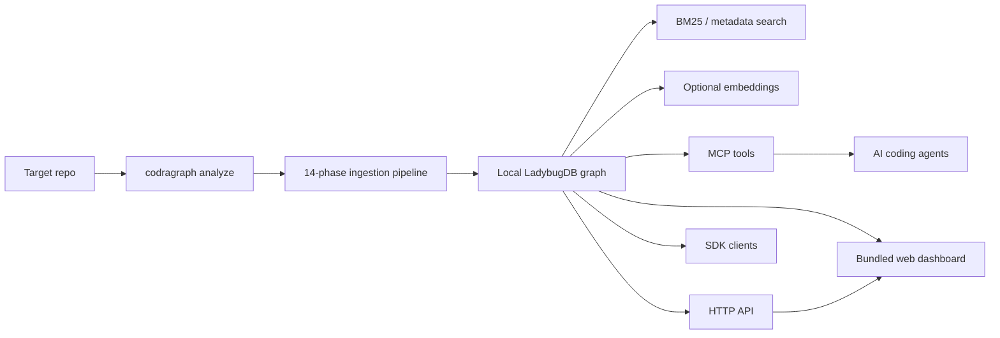

# CodraGraph Documentation

This is the public documentation map for CodraGraph. Start here when you want
the architecture, install path, agent rules, storage behavior, or operational
runbooks without digging through the private development tree.

  

## First Reads

| Doc | Use it for |
|---|---|
| [INSTALL.md](INSTALL.md) | npm, Bun, local dashboard, hosted dashboard, plugin setup. |
| [ARCHITECTURE.md](ARCHITECTURE.md) | Runtime topology, ingestion pipeline, MCP/HTTP/CLI surfaces, graph schema. |
| [AI_AGENT_CLI_GUIDE.md](AI_AGENT_CLI_GUIDE.md) | Exact commands agents should run, and commands/routes they should not invent. |
| [STORAGE_AND_RETRIEVAL.md](STORAGE_AND_RETRIEVAL.md) | `.codragraph` size, BM25, embeddings, compression, corrupt index recovery. |
| [RUNBOOK.md](RUNBOOK.md) | Copy-paste operational checks and recovery steps. |
| [GUARDRAILS.md](GUARDRAILS.md) | Safety rules for humans and AI agents editing or operating CodraGraph. |
| [CONTRIBUTING.md](CONTRIBUTING.md) | Local dev, validation commands, PR expectations. |
| [TESTING.md](TESTING.md) | Test matrix for CLI/core, web, and CI. |
| [CHANGELOG.md](CHANGELOG.md) | Release history and migration notes. |
| [../llms.txt](../llms.txt) | Compact LLM/agent context for public repo navigation. |

## System Map

CodraGraph is local-first. Indexes live under the user's repo in
`.codragraph/`, while the global registry in `~/.codragraph/registry.json`
lets the MCP server discover indexed projects.

## Package And Integration References

The public distribution repository does not expose private source directories,
but it mirrors package and integration READMEs here:

| Mirror | Source package or integration |
|---|---|
| `docs/packages/cli.md` | `@codragraph/cli` |
| `docs/packages/sdk.md` | `@codragraph/sdk` |
| `docs/packages/graphstore.md` | `@codragraph/graphstore` |
| `docs/packages/harness.md` | `@codragraph/harness` |
| `docs/packages/compress.md` | `@codragraph/compress` |
| `docs/packages/org.md` | `@codragraph/org` |
| `docs/integrations/claude.md` | Claude Code plugin |
| `docs/integrations/codex.md` | OpenAI Codex integration |
| `docs/integrations/github-action-pr-review.md` | PR review GitHub Action |

## Agent Rules In One Screen

- Use `codragraph status`, `codragraph list`, `codragraph query`, and
  `codragraph context` before guessing.
- Use `GET /api/info` for REST health checks; use `POST /api/mcp` only through
  an MCP StreamableHTTP client.
- Do not call invented REST paths such as `/api/mcp/tools/list`.
- Do not delete `.codragraph/`, edit `cgdb`/`cgdb.wal`, or run
  `codragraph clean --force` without explicit user approval.
- Do not enable `--embeddings` by default; BM25 and graph search work without
  vectors.
- Use `--compress brotli` for large repos before reaching for embeddings.
