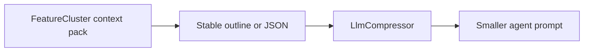

# @codragraph/compress

Lossless semantic compression for LLM context, including CodraGraph
FeatureCluster context packs.

Use this package when the agent already has the right context pack but the
pack is too large for a prompt budget. `@codragraph/compress` keeps the facts
that matter for editing code: files, line ranges, symbols, routes, tools,
processes, dependencies, tests, docs, and safe-edit warnings.

## Install

```sh
npm install @codragraph/compress
```

## Basic Usage

```ts
import { LlmCompressor, compressContextPack } from "@codragraph/compress";
import { harness, graph } from "@codragraph/sdk";

const inference = await harness.makeInferenceProvider("openai");
const graphClient = await graph.createLocalGraphClient();
const settingsPack = await graphClient.contextPack({ name: "Settings" });

const compressor = new LlmCompressor();
const compressed = await compressContextPack(compressor, settingsPack, {
  inference,
  level: "balanced",
  format: "outline",
});

console.log(compressed.clusterName);
console.log(compressed.reduction);
console.log(compressed.compressed);
```

## What It Compresses



`compressContextPack` accepts a `ClusterContextPack` from
`@codragraph/shared` or any compatible object. The helper first serializes the
pack deterministically, then passes it to a `Compressor`.

## Public API

| Export | Purpose |
|---|---|
| `LlmCompressor` | LLM-backed compressor/decompressor. |
| `compressContextPack` | Compress a FeatureCluster context pack as outline or JSON. |
| `estimateTokens` | Lightweight character-based token estimate. |
| `Compressor` | Interface for custom compressors. |
| `CompressOptions` | Inference provider, model, level, strategy, similarity options. |
| `CompressContextPackOptions` | `CompressOptions` plus `format: "outline" | "json"`. |

## Package Composition

| Pair with | Why |
|---|---|
| `@codragraph/cli` | Produces the indexed graph and FeatureCluster packs. |
| `@codragraph/sdk` | Loads context packs programmatically. |
| `@codragraph/harness` | Supplies inference providers and can use compressed packs in tuned recipes. |

## Notes

- This is prompt/context compression, not storage compression. Storage
  compression is the CLI flag `codragraph analyze --compress brotli|zstd`.
- The package is TypeScript/Node-first. Older Python experiments live outside
  the public npm surface.

## License

Apache-2.0. You can use, modify, redistribute, bundle, and host this package
commercially, subject to the Apache-2.0 notice and attribution requirements.
